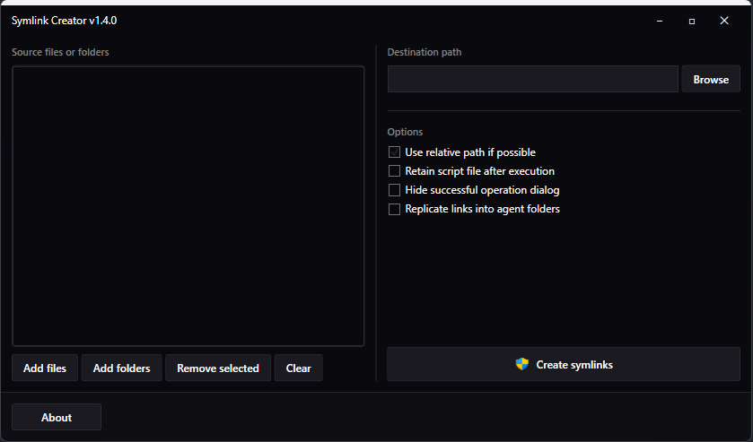

# Symlink Creator
Symlink Creator is a GUI app for creating symbolic links (symlinks), and it is based on the [`mklink`](https://learn.microsoft.com/en-us/windows-server/administration/windows-commands/mklink) command. You can create multiple symlinks at a time.

## Download

[](https://github.com/arnobpl/SymlinkCreator/releases/latest/download/Symlink.Creator.zip)

📦 [Download Symlink.Creator.zip](https://github.com/arnobpl/SymlinkCreator/releases/latest/download/Symlink.Creator.zip)

🗂️ [View all releases](https://github.com/arnobpl/SymlinkCreator/releases)

## Use cases
- Suppose, you have a collection of several songs sorted by artists and albums on your PC. You might want a separate collection of your favorite songs which you will store on your mobile devices. In this scenario, the traditional shortcut option through the File Explorer right-click context menu is insufficient, because you cannot copy the actual file contents by copying the traditional shortcut files (*\*.lnk*). You might consider duplicating the files which you will store on your mobile devices. But it will waste the storage space of your PC. In this case, Symlink Creator will come in handy. You can easily create a separate collection of songs and transfer them to your mobile devices, without wasting your PC's storage space.

- Suppose, you have a special folder that is linked to your online storage like Google Drive. You might want some specific files/folders to be backed up from other folders. A traditional shortcut file is not helpful here to back up those files. In this scenario, you can use Symlink Creator for backup purposes without duplicating those files/folders in the special folder.

- Suppose, you play video games a lot and you have the Steam client to manage those games. You have set a non-system drive (say, *D:*) to download the games. But that non-system drive has slow read capacity but your system drive (say, *C:*) has SSD which is a lot faster to read. In that scenario, you can use Symlink Creator to save your favorite video games in the SSD so that you can load those games faster without changing any settings in the Steam client. Symlink Creator can create symlinks of the folders of video games in the slow non-system drive, but the game files are actually stored in the fast SSD.

## What Symlink Creator does
Symlink Creator creates *symlinks* which is an NTFS feature. Unlike the traditional shortcut files (*\*.lnk*), symlinks do not have any *file size*. While symlinks may be called advanced shortcut files, they appear to be real files. Unlike duplicated files, symlinks do not waste your storage space. Symlink Creator works for both files and folders.

## How Symlink Creator works
- Symlink Creator uses the `mklink` command to create symlinks by generating and executing a script.
- It works on Windows 11/10.
- Prior to version 1.3.0, it also supported Windows 8.1/8, Windows 7, and Windows Vista. Because the [`longPathAware`](https://learn.microsoft.com/en-us/windows/win32/fileio/maximum-file-path-limitation?tabs=registry#enable-long-paths-in-windows-10-version-1607-and-later) feature, introduced in Symlink Creator v1.3.0, is unsupported on earlier Windows versions.
- It does not work on Windows XP due to the absence of the `mklink` command.

## How to use Symlink Creator

- At the `Source file or folder list`, you can add files or folders which will be copied in the `Destination path` as symlinks.
- Using Symlink Creator's drag-n-drop feature, you can easily create multiple symlinks at a time.
  - You can drag-n-drop files/folders directly from File Explorer.
  - You can also drag-n-drop the text containing a list of file/folder paths separated by a new line such as:
  ```
  D:\TestingSymlinkCreator/Src/MyFile1.txt
  D:\TestingSymlinkCreator/Src/MyFile2.txt
  ```
- Tick the `Use relative path if possible` option to use relative paths while creating symlinks. In this case, relative paths will be used if both source files/folders and destination files/folders are in the same drive.
- Tick the `Retain script file after execution` option if you want to save the script file for later use like logging purposes or other advanced usage.
- Tick the `Hide successful operation dialog` option if you want to only show a dialog when an error occurs.

## Why Symlink Creator needs administrative rights
It has been stated before that Symlink Creator uses the `mklink` command to create symlinks. The `mklink` command requires administrative privilege to create symlinks. You can find more information [here](https://learn.microsoft.com/en-us/windows/security/threat-protection/security-policy-settings/create-symbolic-links).

## Enhancements in this Fork

This fork (v1.4.0+) includes modern improvements and professional styling:

### Features
- **Configurable Default Paths**: Customize the default directories in `App.config`:
  - `DefaultSourceFolderPath`: Initial directory for the "Add folders" dialog
  - `DefaultDestinationFolderPath`: Initial directory for the "Destination path" dialog

### Modern UI/UX
- **Professional Dark Theme**: Ultra-dark Catppuccin Mocha-inspired color palette
  - Clean, modern interface with excellent contrast
  - Custom title bar with native window controls (minimize, maximize, close)
  - Smooth gray hover states on all interactive elements
  - Consistent styling across all controls (buttons, text boxes, checkboxes, etc.)
- **.NET 10 WPF**: Latest framework with modern C# features and performance improvements

## License

Licensed under the [MIT License](LICENSE) - © 2019 Arnob Paul
This is a fork of the original [Symlink Creator](https://github.com/arnobpl/SymlinkCreator)

